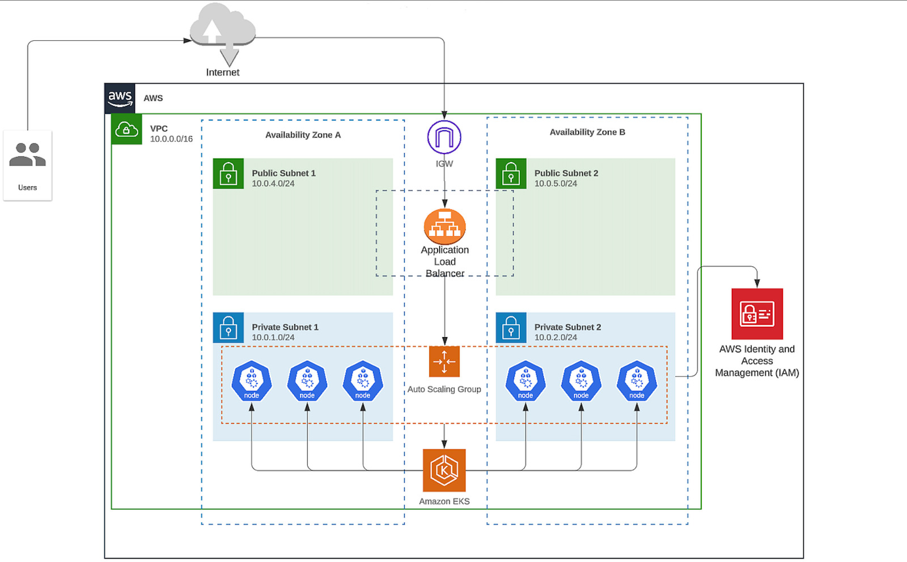

# Web APP on EKS by Terraform

A Terraform-based infrastructure project that deploys an AWS VPC and Amazon EKS cluster with managed node groups, autoscaling support, and required IAM roles.

## Architecture Overview

This repository creates a secure AWS network and an EKS cluster across two Availability Zones:

- VPC with public and private subnets
- Internet Gateway for public subnet access
- NAT Gateway for private subnet outbound internet access
- EKS cluster deployed into private subnets
- Managed EKS node group with autoscaler-ready tagging
- IAM roles and policies for EKS, worker nodes, cluster autoscaler, and OIDC-based service account access

## Diagram



## What this project provisions

- `provider.tf`
  - AWS provider configuration
- `network.tf`
  - VPC, public/private subnets, IGW, NAT Gateway, route tables, and route associations
- `eks.tf`
  - EKS cluster, managed node group, IAM roles, addons, OIDC provider, and service account role support
- `autoscaler.tf`
  - IAM policy and role for Kubernetes Cluster Autoscaler
- `backend.tf`
  - Optional Terraform backend configuration for remote state (if configured)
- `variables.tf`
  - Project variables and input validation
- `output.tf`
  - Useful output values after apply
- `eks/`
  - Kubernetes manifests and helper scripts for working with the created EKS cluster

## Prerequisites

- Terraform 1.5 or later
- AWS CLI configured with appropriate IAM credentials
- `kubectl`, `helm`, and `eksctl` installed locally
- An AWS account with permissions to create VPC, EC2, EKS, IAM, S3, and related resources
- Access to the `us-east-1` region (configured by `provider.tf`)

## Backend and AWS configuration

This repository includes `backend.tf` configured for an S3 remote state backend:

- bucket: `nti-tf-state-mahmoudsh`
- key: `proj01/terraform.tfstate`
- region: `us-east-1`
- encrypt: true
- use_lockfile: true

Before running Terraform:

1. Ensure the S3 bucket exists and is accessible by your AWS credentials.
2. Configure AWS credentials and default region with `aws configure` or environment variables.
3. If you do not want to use the existing bucket/key, update `backend.tf` to your own S3 backend settings.

## Deployment steps

1. Initialize Terraform:

   ```bash
   terraform init
   ```

2. Review the planned changes:

   ```bash
   terraform plan
   ```

3. Apply the infrastructure:

   ```bash
   terraform apply
   ```

4. Initialize and install EKS components:

   ```bash
   ./eks/init_eks.sh
   ```

5. Verify resources in Kubernetes and AWS.

## Destroy workflow

To clean up the deployed Kubernetes resources and EKS add-ons:

```bash
./eks/destroy_eks.sh
```

Then destroy the Terraform-managed AWS infrastructure:

```bash
terraform destroy
```

## EKS post-deployment and Helm

The `eks/init_eks.sh` script performs these post-deployment tasks:

- updates your kubeconfig for the `my-eks` cluster
- creates or refreshes the AWS Load Balancer Controller service account
- installs the AWS Load Balancer Controller with Helm
- installs the Kubernetes Cluster Autoscaler with Helm
- applies example Kubernetes manifests from `eks/deployment.yaml` and `eks/ingress_alp.yaml`

Important notes:

- `eks/init_eks.sh` expects `terraform output -raw vpc_id` to be available from the current working directory.
- Helm repos used:
  - `eks` for `aws-load-balancer-controller`
  - `autoscaler` for `cluster-autoscaler`
- `eks/destroy_eks.sh` removes the deployed Helm charts, Kubernetes manifests, and the `aws-load-balancer-controller` IAM service account.

## Notes

- The EKS cluster is configured with both public and private endpoint access.
- The node group launches in private subnets and uses an On-Demand capacity type.
- Labels and tags are created so the cluster autoscaler can manage scaling.
- `eks/` contains additional YAML manifests and scripts for cluster bootstrap and management.

## Useful files

- `eks/deployment.yaml` - example Kubernetes deployment manifest
- `eks/serviceAccount.yaml` - example Kubernetes service account manifest
- `eks/init_eks.sh` - helper script for EKS cluster initialization
- `eks/destroy_eks.sh` - helper script to delete EKS resources manually
- `eks/ingress_alp.yaml` - example ALB ingress manifest
